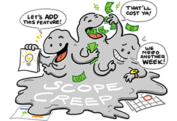
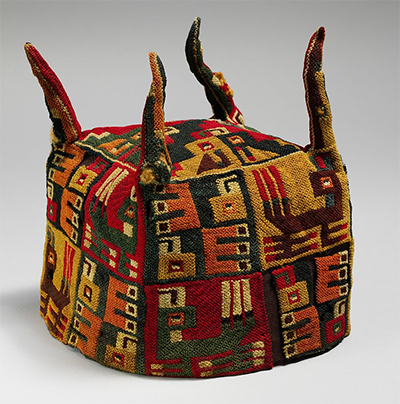

## First and foremost...

* Be explicit
    * Write it/them down
    * Beware the scope creep...

* Refine
    * Ask questions (what is known currently, what is the significance, how does this relate to the work of the field(s), etc)
    * Narrow, then narrow further 
        * What is the timeframe for the work?
        * What are the available resources?
        * Beware the scope creep...
    * Agree on what your role is in relation to the RQ(s)
        * Be explicit - write it down
        * Be persistent but flexible - RQ is your guide, how might change

**Data model**

Abstract representation of the elements and structure of a database, including information about the properties and relationships between elements. 

## Let’s get modeling!

**Research Question**: Are the number of colors in a hat related to the status of the individual?

### What information do you need in order to answer this question?

> ## Challenge
> Identify what information is needed using the post-its and markers.
>
> > ## Solution
> > * Hats
> >    * Number of unique colors
> >* Status
> >    * individuals
> >* Hat <-> Status relationship 
> >    * need some kind of context information that links these two concepts
> {: .solution}
{: .challenge}

### What data do you need in order to answer this question? What do you need to know about the data?

> ## Challenge
> Identify what data provides this information and what you need to know about the data.
>
> > ## Solution
> > Data records
> > * Hat record that lists the colors used in the hat and the context of where the hat was found
> > * How is status determined?
> >     * Need criteria for high vs low status 
> >         * High = tomb burial, presence of grave goods
> >         * Low = pit burial, no grave goods
> >         * Context data needs to have type of burial
> >     * Finds associated with individual (“grave goods”)
> > * Therefore we need an individual record that details the context and status of the individual...
> > * Burial record that lists all of the finds found in a burial & type of burial & individual in the burial
> > * Grave goods, human remains, and hats are all types of finds - need finds records
> {: .solution}
{: .challenge}

Things to keep in mind at this stage:
* What kind of processing is necessary to collect/access these data?
    * Field work, collection procedures, specialist expertise, OCR, transcription/translation/transliteration, annotations, cleaning, migrating, normalizing?
* Any requirements being revealed?
    * Policy for outliers (tomb with no grave goods, pit with grave goods)
